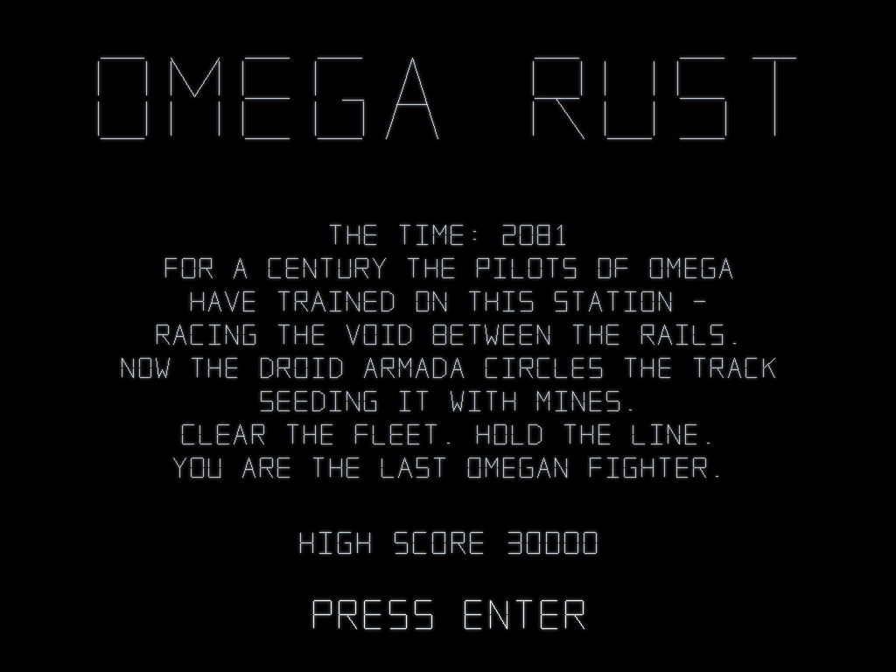
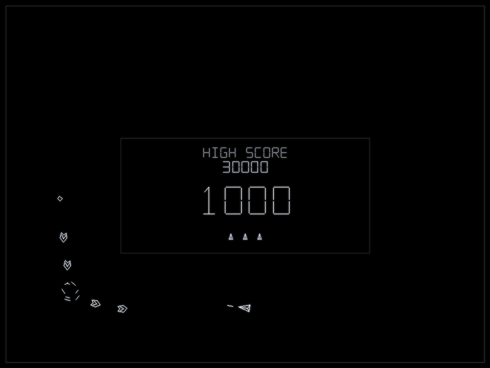
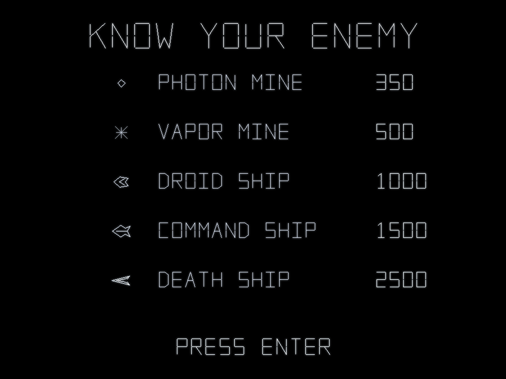

# OMEGA RUST

A vector-graphics homage to **Omega Race** (Midway, 1981) — Midway's only
vector arcade game — written in Rust. The wordplay is intentional.



You fly the last Omegan fighter around a race track in space. A droid convoy
circles the track seeding it with mines, and escalates: Droids become Command
Ships that shoot back, Command Ships become Death Ships that hunt you. The
borders are force fields — you *bounce* off them, and good pilots bounce on
purpose.



## Running

```sh
cargo run --release
```

| Key | Action |
|---|---|
| ← → / A D | rotate (spinner-fast) |
| ↑ / W | thrust |
| Space | fire (max 4 shots live) |
| Enter | start |
| P | pause · M mute · F fullscreen · Esc back |

Extra ship at 40,000 and 100,000, then every 100,000. Every 4th wave cleared
pays a **FLEET BONUS 5000** and sweeps the track of mines.



## How it's built

The game emits **vectors, not pixels**: game logic writes a display list of
line segments each frame, exactly like the original's CPU fed its X-Y
monitor. Two backends consume it:

- **Screen** — macroquad, with a phosphor pipeline: additive line pass,
  persistence buffer (decaying trails), and a separable Gaussian glow.
- **Headless** — a pure-CPU rasterizer that writes PNGs with no window or
  GPU, driven by scripted inputs at a fixed 60 Hz with a seeded RNG, so any
  moment of gameplay is reproducible byte-for-byte:

```sh
cargo run --release -- --headless --frames 720 --shot-every 30 \
    --out shots --script verify/wave1.script
```

Every glyph on screen is a stroke font (segment lists) — no TTFs, no fills,
no sprites. All sound is synthesized at startup in the flavour of the
original's twin AY-3-8912 PSGs: square waves, noise bursts, fast sweeps —
including a convoy heartbeat that accelerates as the fleet thins.
`--dump-sfx DIR` writes the generated bank as WAVs.

`DESIGN.md` is the full creative brief; `verify/` holds the scripted
demos used to visually verify each milestone.

## Provenance

Directed by Claude (Fable 5) as creative lead; implemented milestone-by-
milestone by GPT-5.6 via Codex, each stage verified through the headless
harness. Gameplay values (350/500/1000/1500/2500 points, bonus ships at
40k/100k) follow the 1981 original.
